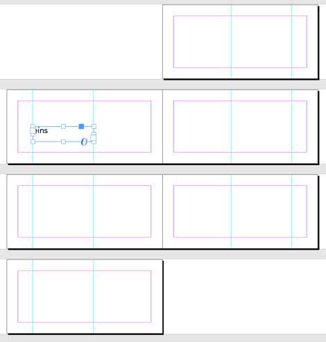
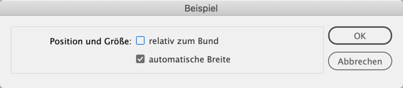

# Pagenumbers as Text

(currently this script is german-only)

## The Idea

In case you want your pagenummbers not like "1, 2, 3" but like "one, two, three" this script can be of help.

Consider this document as starting point:

## The Parameters

If the document is facing pages you will get asked for two parameters:

These parameters will result in:

With these 

you get

and with these

you get

If the document is not facingPages, the parameters are "not rel to Binding" and "auto resize" by default.

## AutoResize or linked textframes

Textframes can only be autoresized when they are not linked in a story. Thus, if you select autoresize, you'll get an unlinked textframe per page.

# Numbers as text

In `assembleNumberStrings.jsx` and `assembleNumberStringsEn.jsx` you can find the core of the script: the conversion of a number to its string representation.
These two simply write a textfile on the desktop.